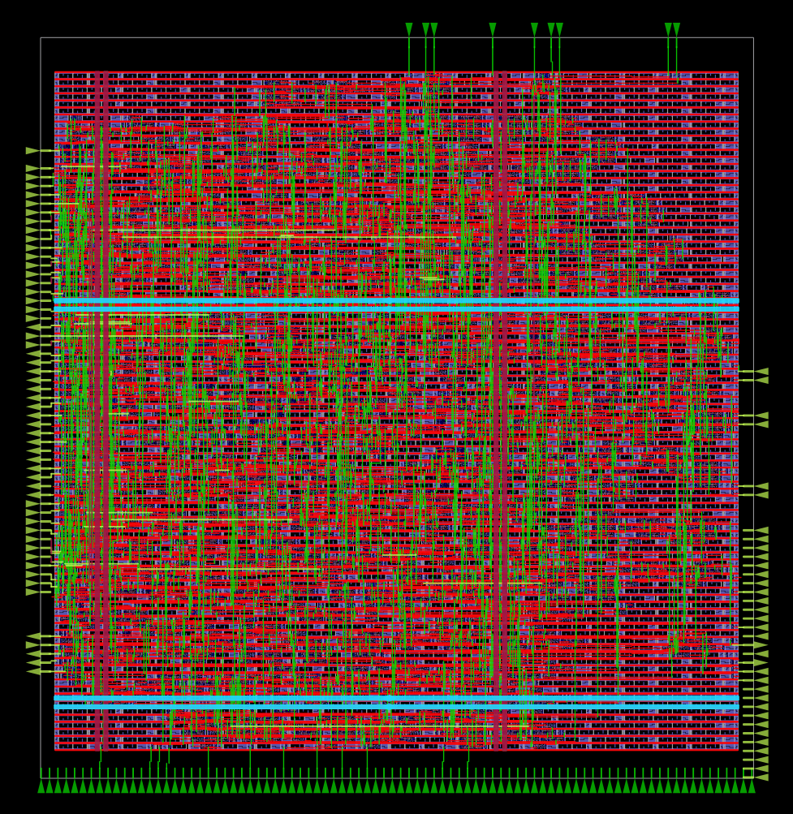
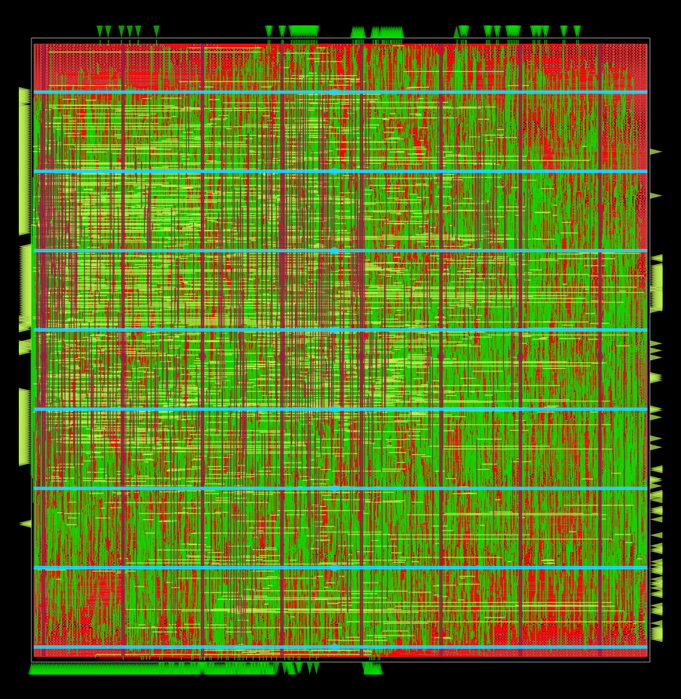
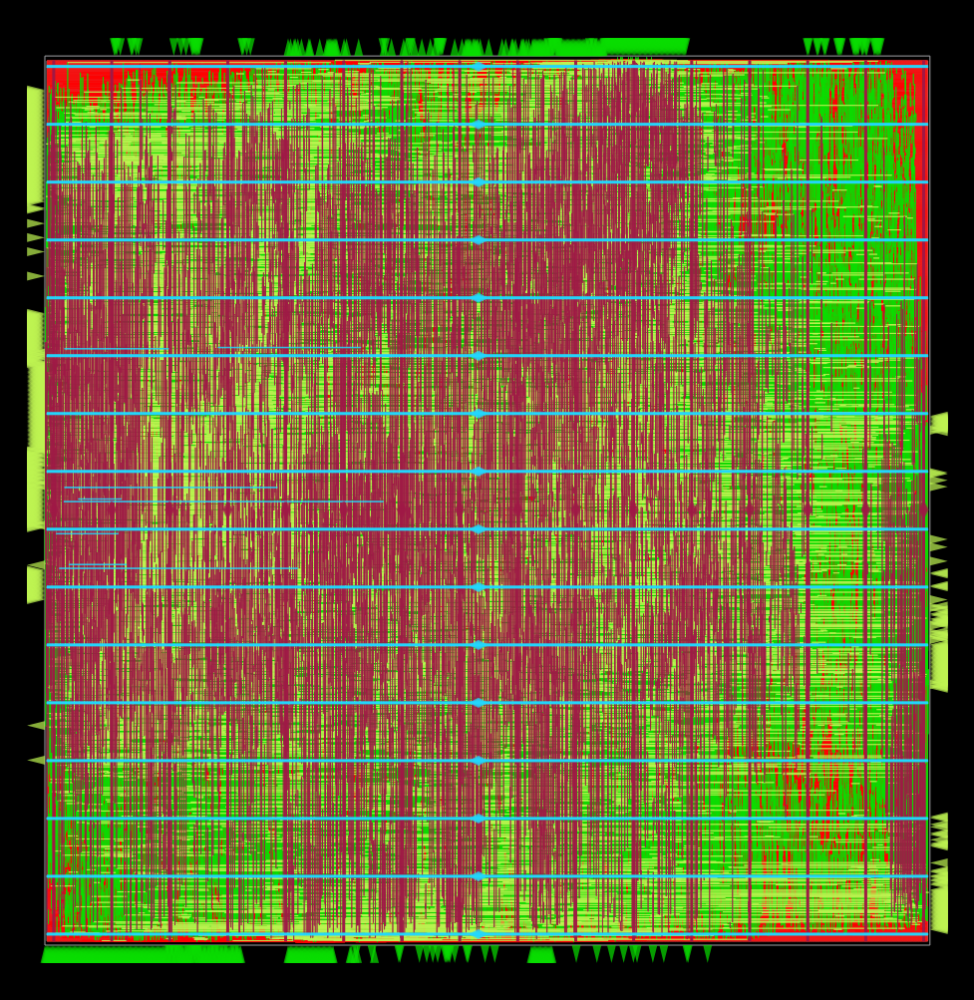
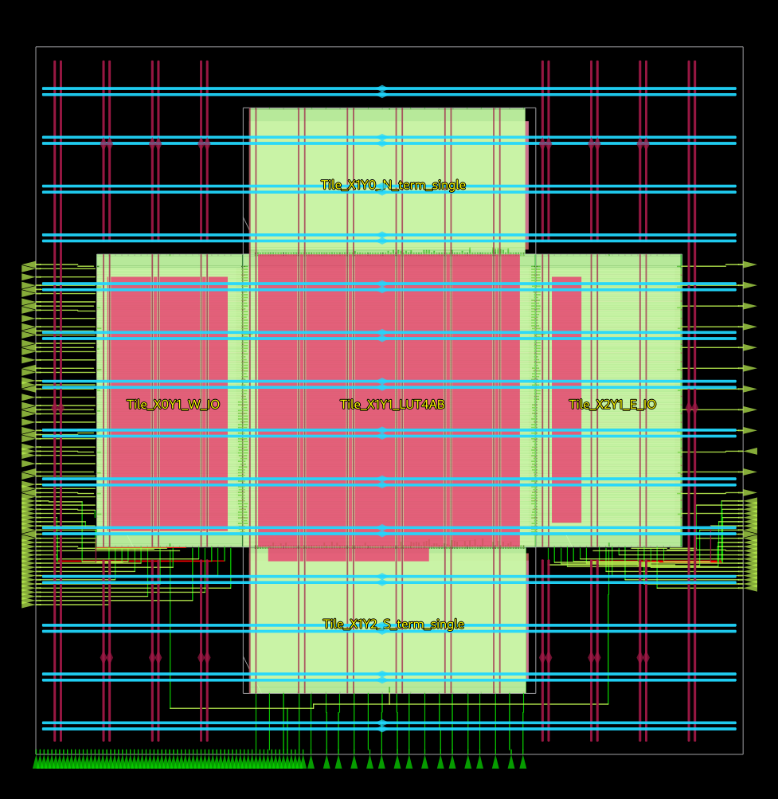
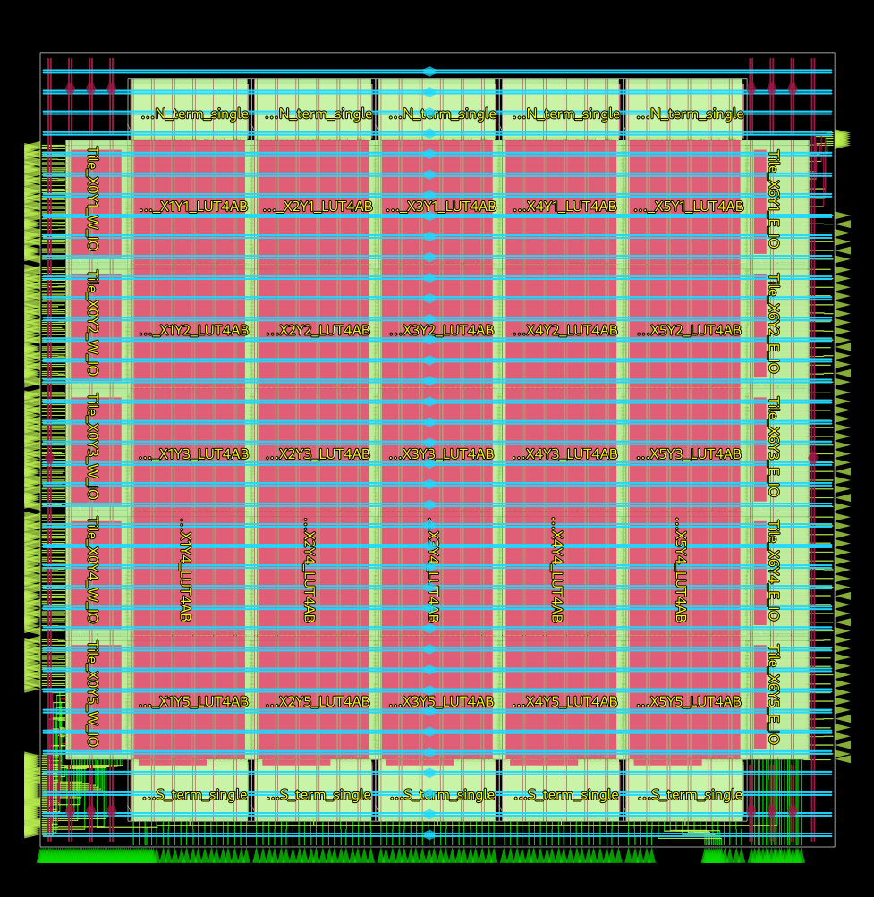
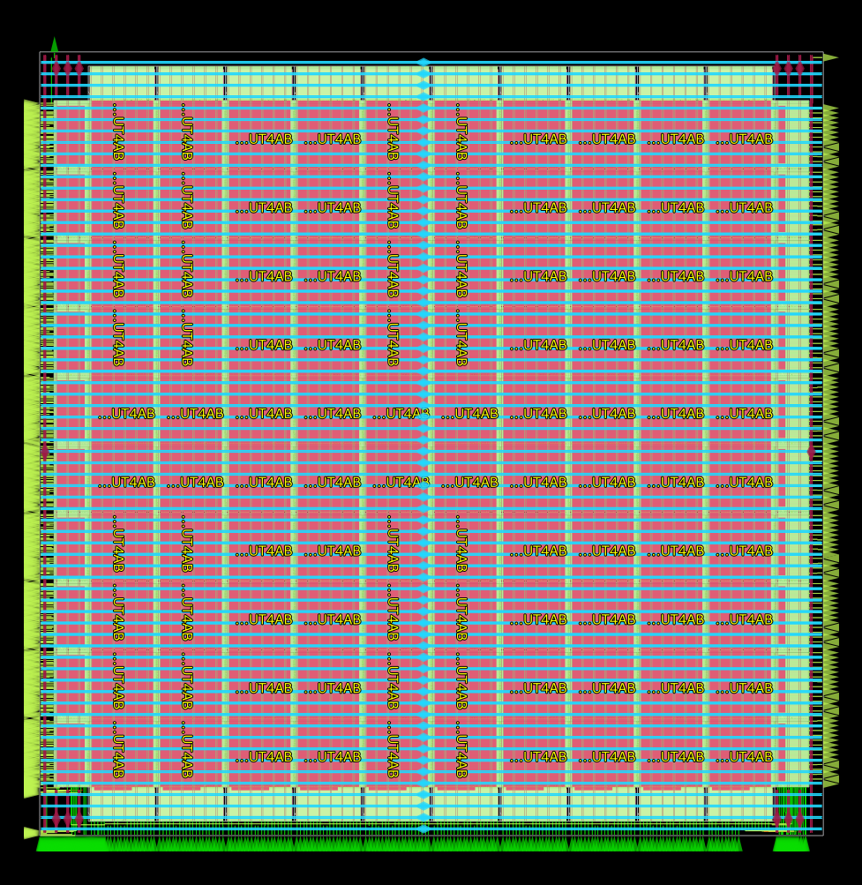
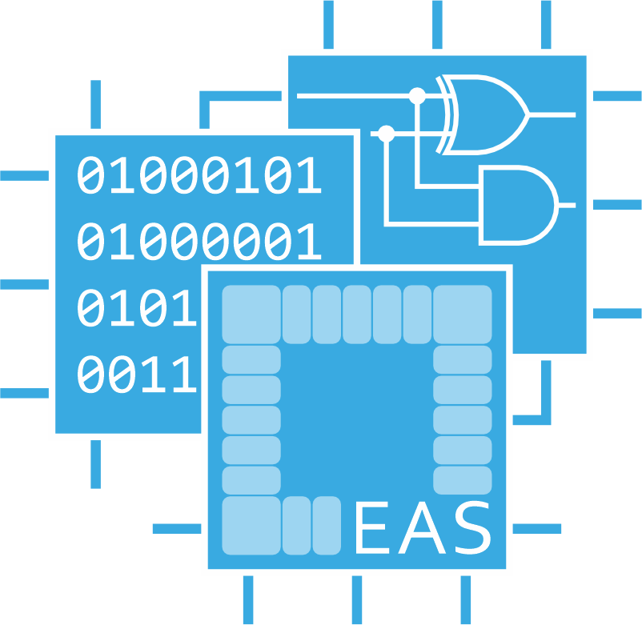

# Stitching FPGA Fabrics with FABulous and OpenLane 2

## Introduction

This repository contains scripts to generate various homogeneous FPGA fabrics using FABulous and harden them via OpenLane 2.

Two approaches are possible:

- Sea of Gates

| 1x1 CLB  | 5x5 CLB  | 10x10 CLB  |
|---|---|---|
|   |   |   |

- Fabric Stitching

| 1x1 CLB  | 5x5 CLB  | 10x10 CLB  |
|---|---|---|
|   |   |   |

The fabric stitching process utilizes OpenLane 2's Python API.

### Acknowledgement

  
  
  

This repository includes results of research in the [Embedded Architectures & Systems](https://iti.tugraz.at/eas) (EAS) Group at [Graz University of Technology](https://www.tugraz.at). 

## Prerequisites

### FABulous

Clone our FABulous fork using:

	git clone https://github.com/EAS-DSD/FABulous

It must be located in the root directory of this repository.

Note: FABulous is currently heavily under development, and although the changes to FABulous have been upstreamed during this work, these changes are in the development branch of FABulous. Thus we created our fork with the necessary changes.

Setup a virtual environment in Python and install the required packages as described in the `README`.

### OpenLane 2

Clone the OpenLane 2 repository using:

	git clone https://github.com/efabless/openlane2

And checkout the following commit: `aef54ecd99f158610a1ce95534f7d9365e48914e`

Install and setup Nix as explained in the [documentation](https://openlane2.readthedocs.io/en/latest/getting_started/common/nix_installation/index.html).

Whenever you need to use OpenLane 2, first invoke `nix-shell` from within the OpenLane 2 repository.

# Harden the Fabrics

**Note:** To disable `LVS` and `DRC` set `NO_CHECKS=1`. To open a hardened design in KLayout or OpenROAD set `OPEN_IN_KLAYOUT=1` or `OPEN_IN_OPENROAD=1`.

## Build the Fabrics

Make sure to enable the FABulous virtual environment, now call:

	make generate_fabrics

The fabrics are generated under `output/`.

## 1. Sea of Gates - Harden the Whole Fabric

Invoke the `nix-shell` from within the OpenLane 2 repo.

Now inside this repository, call:

	make sea_of_gates_fabrics

## 2. Fabric Stitching with Custom Placement

Invoke the `nix-shell` from within the OpenLane 2 repo.

First, the tiles must be hardened individually. Inside this repository, call:

	make harden_tiles

After the tiles are hardened as macros, call:

	make stitch_fabrics

# Generate and Run a Batch of Fabrics

To create various sizes of fabrics, run:

	./generate_batch.py

To stitch them together to a final design, run:

	./run_batch.py

# Create Diagrams of Measurements

To create diagrams with `matplotlib`, run:

	./create_diagrams.py

# Cleanup

To remove all intermediate files:

	make clean

To remove all OpenLane 2 output:

	make clean_openlane

To remove the generated fabrics:

	make clean_fabrics

To remove the hardened macros:

	make clean_macros

